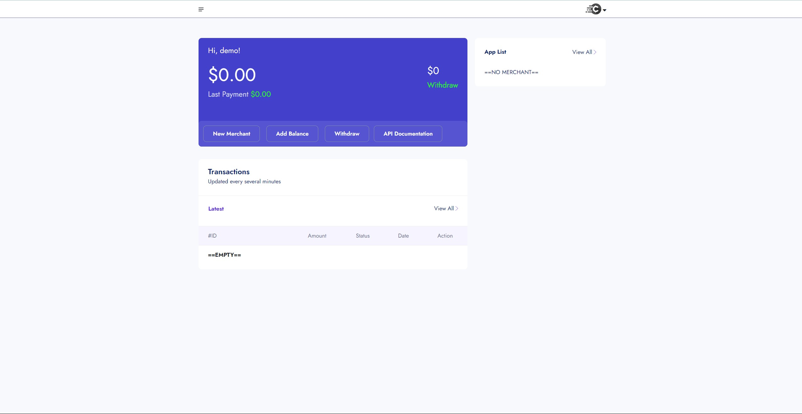
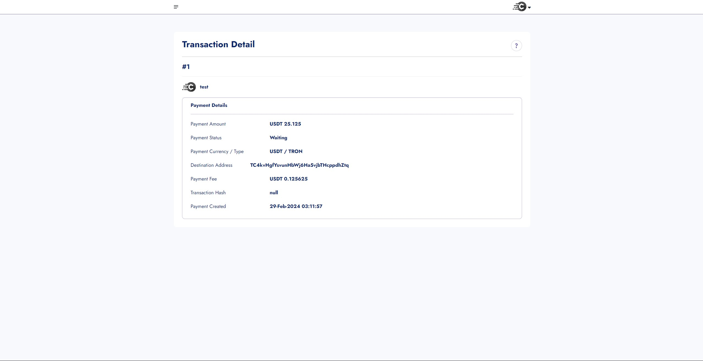
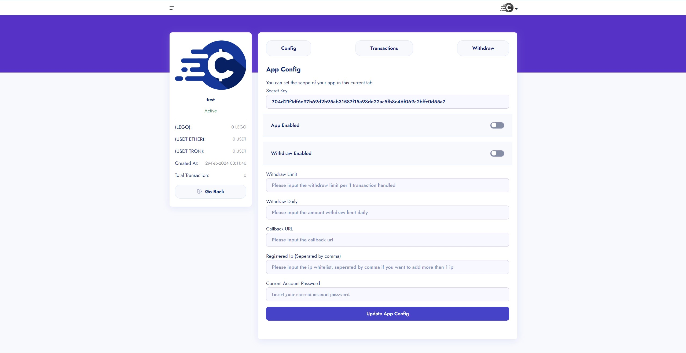

# Crypto Payment Gateway

Welcome to the Crypto Payment Gateway project repository! This payment gateway allows merchants to accept cryptocurrency payments seamlessly, providing features such as dynamic addresses for each transaction, transaction monitoring, and API documentation.

## Features

1. **Create Merchant**: Merchants can easily create accounts to start accepting cryptocurrency payments. Upon registration, merchants are provided with API keys and access to the dashboard.

2. **Check Transaction**: Merchants can monitor and track transactions in real-time. They can view transaction details, including amounts, status, and timestamps.

3. **Dynamic Address**: Each transaction is assigned a dynamic cryptocurrency address. This ensures security and privacy for both merchants and customers, as addresses are generated uniquely for each transaction.

4. **Callback and API Documentation**: Comprehensive API documentation is provided for seamless integration with merchants' websites or applications. Callback functionality allows merchants to receive notifications about transaction status updates.

5. **Blockchain Support**: The payment gateway supports multiple blockchains, allowing merchants to accept payments in various cryptocurrencies such as Bitcoin (BTC), Ethereum (ETH), and others.

6. **Landing Page**: A landing page is included to provide information about the payment gateway, its features, and benefits for merchants.

## Screenshots


*Merchant Dashboard: Overview of transaction activity and account settings.*


*Transaction Detail: View details of individual transactions, including amounts and status.*


*Merchant Configuration: Configure merchant settings and API keys.*

## Installation

1. Clone the repository:

   ```bash
   git clone https://github.com/bobys16/crypto-payment-gateway.git
   ```

2. Set up your PHP environment:

   Ensure you have PHP installed on your system. You can download it from [php.net](https://www.php.net/downloads.php) if you haven't already.

3. Configure environment variables:

   Create a `.env` file in the root directory and add necessary environment variables such as database credentials, API keys, and server configurations.

4. Start the server:

   Use a PHP server to run the project. You can use the built-in PHP server for development:

   ```bash
   cd crypto-payment-gateway
   php -S localhost:8000
   ```

5. Access the dashboard:

   Open your web browser and navigate to `http://localhost:8000/dashboard` to access the merchant dashboard.

## API Documentation

For detailed API documentation and integration instructions, refer to [API Documentation](/doc/index.html).

## Contributing

Contributions are welcome! If you'd like to contribute to the project, please fork the repository, make your changes, and submit a pull request. Be sure to follow the contribution guidelines.

## License

This project is licensed under the [MIT License](LICENSE).
EOF
